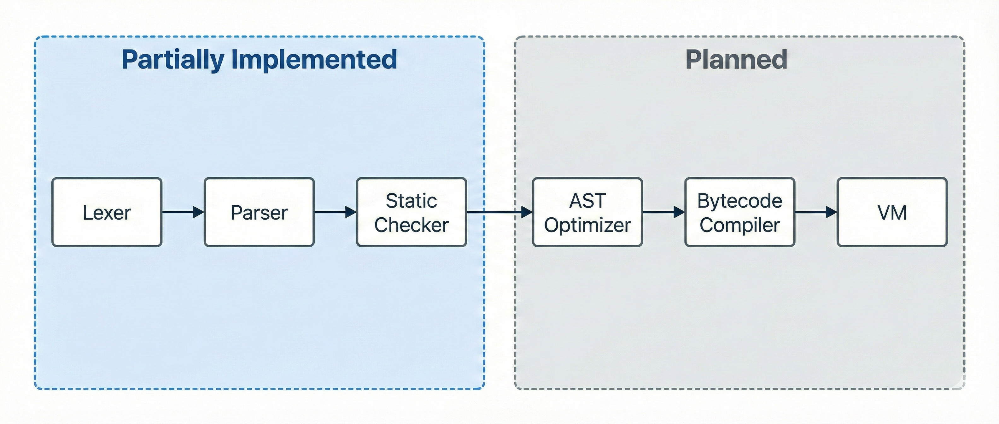

## Core Subsystems
### Arena Allocator (src/cr_mem.h)
Caret uses an **Arena Allocator** to avoid the complexity of manual `malloc/free` management and reduce system call overhead. This technique significantly improves performance and prevents memory fragmentation. Key structures like the AST, strings, and types are stored in these arenas. *(See `src/main.c` for arena initialization details.)*

### String & Type Interning (src/cr_intern.h)
Comparing complex nested types and long strings is computationally expensive. Since these structures appear frequently in source files, we use **interning** to avoid creating duplicate instances. This technique reduces memory usage and allows for fast **O(1) pointer comparisons** instead of slow deep comparisons.

## The Pipeline
1. **Lexer**
    - Produces tokens per order
    - Reads file as a valid UTF-8 sequence
2. **Parser**
    - Uses **Recursive Descent** for statements.
    - Uses a **Pratt Parser** for expressions (handling precedence efficiently).
    - Produces the Abstract Syntax Tree (AST).
3. **Static Checker**
    - Validates type usage within the AST.  
    - Performs scope analysis using `src/cr_symtab.h`.
    - Annotates the AST with local/global slot numbers for future code generation.